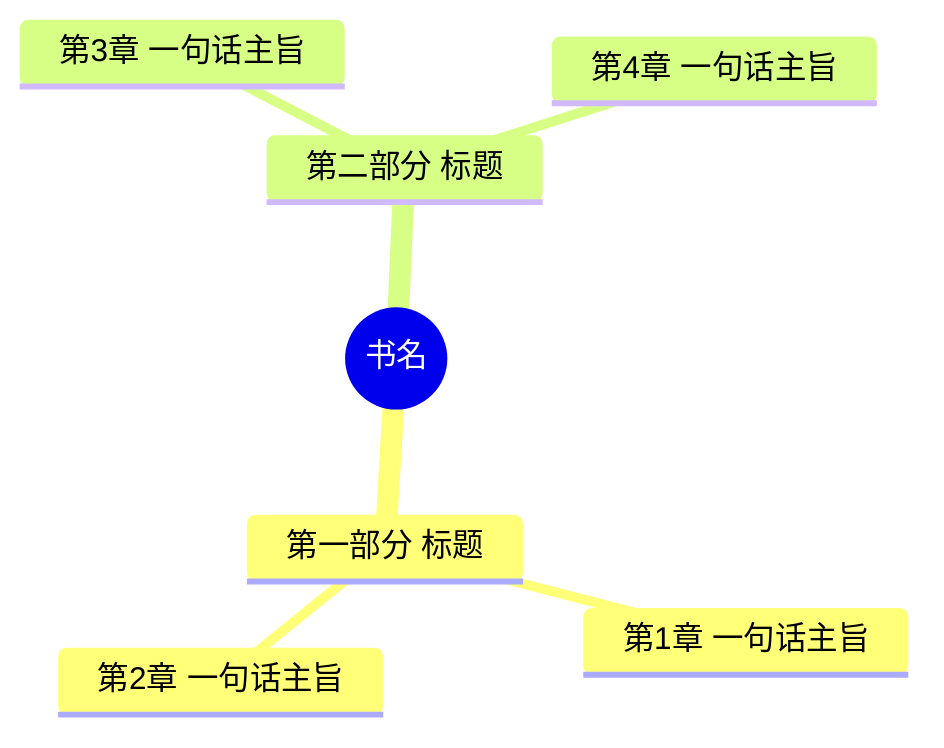
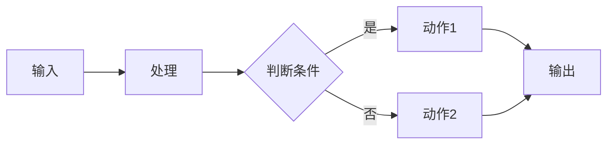

# 快速读完一本书——管理者精读萃取系统

> 版本：V2026.07.01
> 用途：帮助管理者在不接触原书的前提下，系统、深度地"读完"一本管理/社科类书籍，并获得可落地的决策启示

让一本管理/社科类书籍从"束之高阁"变为"已读且可用"。通过10步结构化萃取，输出一份可独立成篇的精读报告——既完整还原全书脉络（让使用者真正"读完"），又聚焦管理者视角的决策启示（让阅读转化为领导力）。

## 适用与不适用

**适用**：管理学、领导力、组织行为、战略、经济、政治、社会、心理、历史等非虚构类书籍；管理者时间有限但需深度掌握一本书的场景。

**不适用**：小说/虚构类、诗歌散文、单纯书单推荐、单一知识点速查。

## 核心流程（10步）

1. **执行摘要** — 一页纸全景，让领导30秒决定是否深读
2. **书籍定位与价值锚定** — 这本书对"我"意味着什么
3. **全书结构总览** — 用思维导图还原书籍骨架
4. **逐章精粹萃取** — 核心步骤，让使用者真正"读完"全书
5. **核心框架与模型提炼** — 把方法论变成可复用工具
6. **关键反常识与认知突破** — 击碎管理惯性
7. **管理决策启示** — 翻译为领导力动作
8. **行动与决策清单** — 5-7条可立即推进的事项
9. **金句与思想锚点** — 留存可复用的智慧
10. **延伸阅读与终极结论** — 一句话刻进脑子

---

## 启动方式

用户输入书名即可开始。若未输入书名，可礼貌询问"您想精读哪本书？"。若书籍信息不足（如作者、版本存疑），先简要确认。

---

## 核心原则

1. **忠实原文**：所有萃取必须依托书籍真实内容，注明章节出处；不得编造观点、案例或数据
2. **管理者视角**：始终以"这对我做决策、带团队、定战略有何启发"为过滤标准
3. **完整覆盖**：逐章萃取不可偷工减料，让使用者真正"读完"，而非只读摘要
4. **可落地**：每一条启示都应能指向一个具体的决策或动作
5. **视觉清晰**：善用表格、Mermaid图表、引用块，让长报告依然好读

---

## 步骤一：执行摘要（Executive Summary）

**目的**：让管理者在30秒内把握全书价值，并判断是否值得投入时间深读。

**输出内容：**

| 维度 | 内容 |
|------|------|
| 一句话定位 | 本书在讲什么、解决什么问题 |
| 作者分量 | 作者背景与权威性（1-2句） |
| 阅读价值评级 | 对管理者的相关度（高/中/低）+ 简述理由 |
| 三大核心收获 | 用①②③列出全书最值得带走的3个观点 |
| 适合谁读 | 管理者类型/典型场景 |
| 时间投入建议 | 完整精读本报告所需时间 |

---

## 步骤二：书籍定位与价值锚定

**目的**：先搞清这本书"对管理者意味着什么"。

**执行动作：**
- 书籍类型与所属领域（管理/战略/组织/经济/社会/心理等）
- 作者背景：身份、代表作、思想流派、时代背景
- 成书背景：写作年代、所回应的时代问题
- 核心命题：本书试图回答的根本问题
- 管理者 relevance：为什么今天的领导者应当读它
- 潜在局限：本书的边界与可能过时之处（客观标注，不回避）

---

## 步骤三：全书结构总览

**目的**：用一张图让使用者建立全书的"地图感"，后续逐章精粹才有坐标。

**执行动作：**
- 还原目录结构（篇章层级，忠实原书）
- 用 Mermaid 思维导图可视化全书骨架
- 每个章节用一句话点明主旨

**输出示例（Mermaid mindmap）：**



---

## 步骤四：逐章精粹萃取（核心步骤）

**目的**：这是本技能的灵魂。让使用者在未读原书的前提下，真正"读完"全书每一章。**不要刻意精简**——宁可篇幅更长，也要保证每章的核心论点、关键论据、关键案例、关键模型都被完整呈现。

**执行动作：**

对全书**每一个章节**，输出以下结构：

#### 第N章 章节标题

- **核心论点**（1-2句精准概括本章主张）
- **关键论据与逻辑**（作者是如何论证的，2-4条）
- **关键案例/数据**（书中用以支撑的重要案例、研究、史实，注明出处）
- **关键模型/方法/概念**（本章提出或引用的可复用工具，若有则列，无则注明"本章无显式模型"）
- **管理者启示**（本章对领导者决策、组织、团队的直接启发，1-2条）
- **章节小结**（一句话凝练）

**原则：**
- 章节较多时，可按"部分/篇"归组，但每个章节都要独立成块，不得合并遗漏
- 长章节可适当展开；短章节可精炼，但四要素（论点/论据/案例/启示）不可缺
- 所有内容忠实原文，不主观发挥；引用观点须注明章节

---

## 步骤五：核心框架与模型提炼

**目的**：把散落各章的方法论收敛为2-4个可复用的管理框架。

**执行动作：**

每个框架需包含：
1. 框架名称与提出章节
2. 框架要素说明（表格形式）
3. 用 Mermaid 流程图/结构图可视化框架
4. 管理者如何套用此框架（具体决策场景）

**输出示例（Mermaid flowchart）：**



---

## 步骤六：关键反常识与认知突破

**目的**：管理者最需要的，往往是打破惯性认知的那一下。

**执行动作：**

提取书中**3-5条**反常识观点，每条包含：

| 元素 | 说明 |
|------|------|
| 常规认知 | 多数人默认的判断 |
| 书中观点 | 作者的主张（注明出处） |
| 论证依据 | 作者如何论证 |
| 管理者启示 | 这对决策意味着什么 |
| 落地小试 | 今天可做的1个小改变 |

---

## 步骤七：管理决策启示

**目的**：把书本知识翻译成"领导力动作"。

**执行动作：**

围绕管理者核心命题，给出本书带来的具体启示（按书中实际内容取舍，不生造）：
- **战略层面**：对方向选择、竞争、创新的启示
- **组织层面**：对结构、流程、文化的启示
- **人才层面**：对选用育留、激励、授权的启示
- **执行层面**：对目标、节奏、复盘的启示
- **自我修炼**：对领导者自身心智、习惯的启示

每条启示须有书籍依据，并指向具体决策场景。若某层面本书未涉及，注明"本书未涉及"而非强行附会。

---

## 步骤八：行动与决策清单

**目的**：让阅读直接转化为下一步动作。

**执行动作：**

输出**5-7条**可推进的事项，每条包含：

| 元素 | 说明 |
|------|------|
| 决策场景 | 在什么情境下用到 |
| 具体动作 | 做什么 |
| 完成标志 | 如何判断已做到 |
| 时间建议 | 何时启动/周期 |

清单按"优先级"排序，并在开头标注 **TOP 1 最该先做的事**。

---

## 步骤九：金句与思想锚点

**目的**：留存可直接引用、传播、提醒自己的智慧。

**执行动作：**

提取**不少于10条**原文金句，每条补充：

| 元素 | 说明 |
|------|------|
| 原文金句 | 忠实原文，注明章节 |
| 管理者解读 | 这句话对领导者意味着什么 |
| 适用场景 | 决策/带团队/自我提醒等 |

---

## 步骤十：延伸阅读与终极结论

**目的**：合上书，开启下一步。

**执行动作：**
- **延伸阅读**：3-5本同源/进阶书籍，每本一句话推荐理由
- **对照观点**：1-2本持不同立场的书，帮管理者形成多元判断
- **终极结论**：一句话，同时包含"全书核心观点"与"对管理者的价值"

---

## 输出模板

完成后输出为结构化Markdown报告，建议结构如下（可按书籍特点微调）：

```markdown
# 精读报告：《书名》
> 生成日期：YYYY-MM-DD ｜ 阅读建议：约XX分钟 ｜ 管理者相关度：高/中/低

## 〇、执行摘要
[一页纸全景表 + 三大核心收获]

## 一、书籍定位与价值
[定位、作者、命题、relevance、局限]

## 二、全书结构总览
[Mermaid思维导图 + 章节一句话主旨]

## 三、逐章精粹
### 第一部分 XXX
#### 第1章 XXX
- 核心论点：
- 关键论据：
- 关键案例：
- 关键模型：
- 管理者启示：
- 章节小结：

...（每章独立成块，不合并遗漏）

## 四、核心框架与模型
### 框架1：XXX
[要素表 + Mermaid图 + 套用场景]

## 五、关键反常识
[3-5条反常识表]

## 六、管理决策启示
[战略/组织/人才/执行/自我修炼]

## 七、行动与决策清单
[5-7条优先级清单]

## 八、金句与思想锚点
[10+金句表]

## 九、延伸阅读与终极结论
[延伸书单 + 终极一句话]
```

---

## 排版与可视化规范

为保证长报告的可读性，输出时遵循：

1. **图表优先**：能用图不用表，能用表不用纯文字
2. **Mermaid图表**：结构总览用 mindmap；框架流程用 flowchart；对比关系用表格
3. **分块清晰**：每章用三级/四级标题独立成块，章节间配水平分隔线
4. **重点高亮**：核心论点、终极结论用引用块（>）突出
5. **表格化**：金句、反常识、行动清单等结构化内容一律用表格
6. **避免冗文**：每段控制在3-5行，长论述拆为要点
7. **客观表述**：不使用任何人格化引导（如"某某认为""我来陪你聊"），保持专业、克制、第三方的表述

---

## 温馨提示

- 整个萃取过程严格忠实原文，凡引用观点/案例/数据须注明章节
- "管理者启示"须以书籍内容为依据，不主观拔高、不强加商业语境
- 若书籍为经典著作，可适当补充"后世影响/学术地位"以增强厚度
- 若书籍偏薄或偏理论，逐章萃取仍需覆盖全部章节，但每章可更精炼
- 报告篇幅应与书籍厚度匹配：宁可详尽，不可为求短而漏掉章节

*本技能持续迭代，服务于管理者的深度阅读与决策赋能。*
